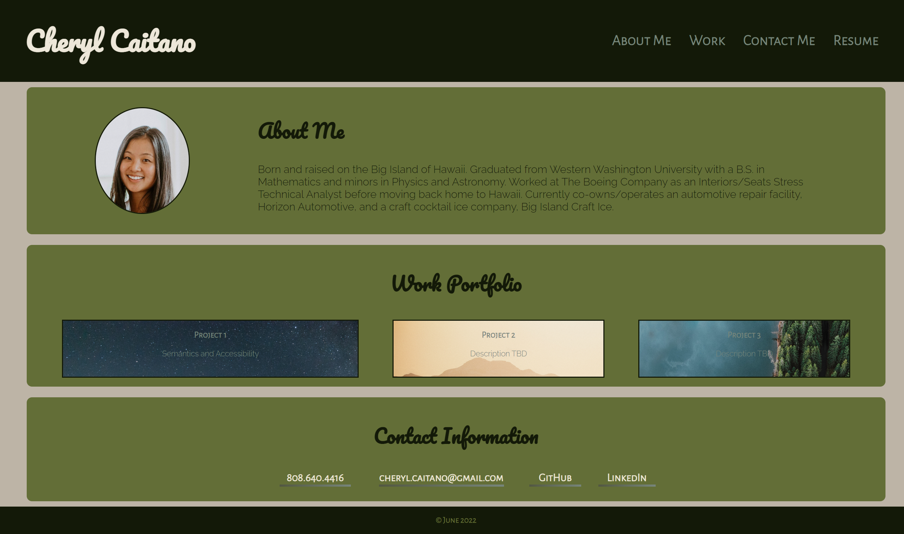
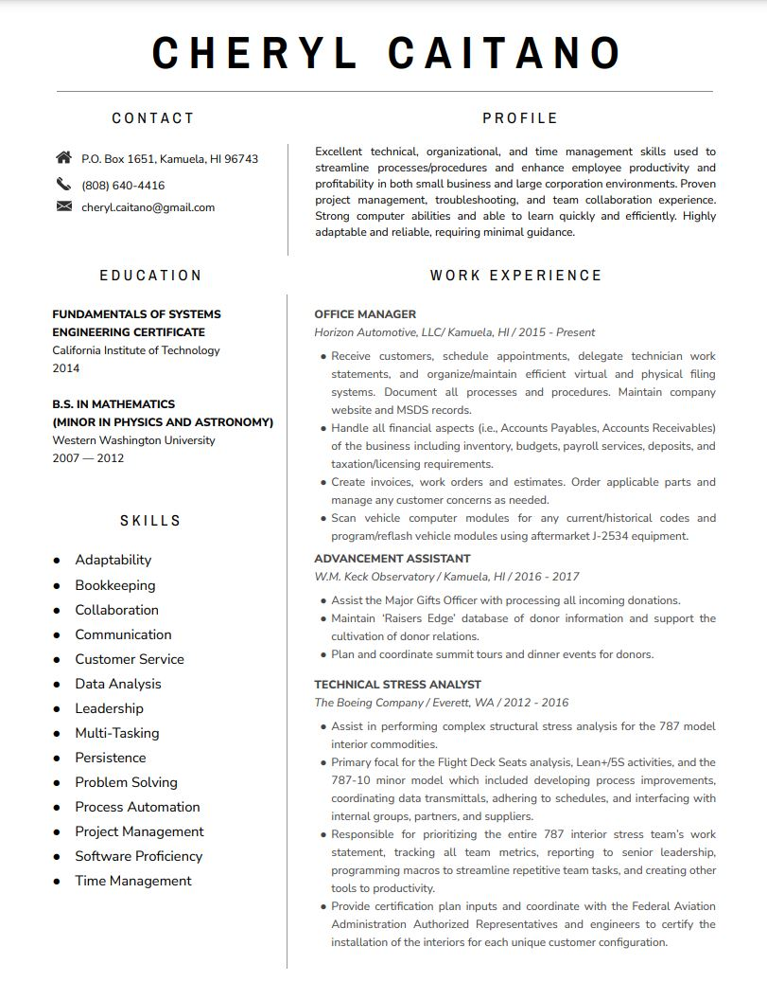

# skills-portfolio
#### By Cheryl Caitano

## Module 2 Challenge - Advanced CSS: Creating a Professional Portfolio

Creating an online portfolio of work to showcase skills and talents to potential employers using HTML and CSS.

### Table of Contents

1. [General Info](#general-info)
2. [Technologies Used](#technologies-used)
3. [Setup](#setup)

### General Info

Work portfolio aimed at showcasing skills and projects to potential employers. Utilizes flexbox, media inquiries and CSS variables.

#### Screenshots

Main Page:

Resume:

### Technologies Used

* HTML
* CSS

### Setup 

1. Go to <a href="https://ccaitano.github.io/skills-portfolio" alt="Work Portfolio Site">Cheryl Caitano's Work Portfolio</a> in your browser

Copyright (c) June 2022

